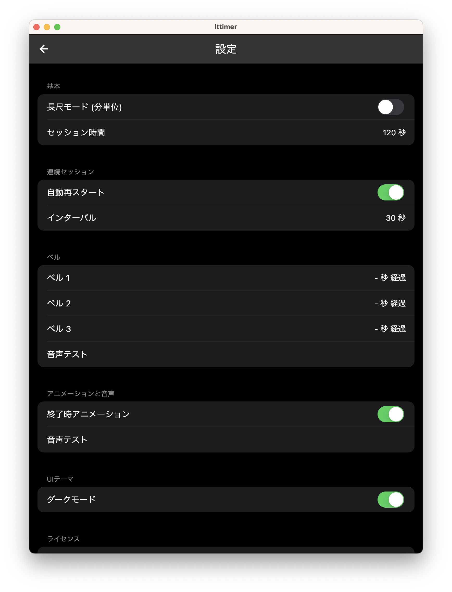
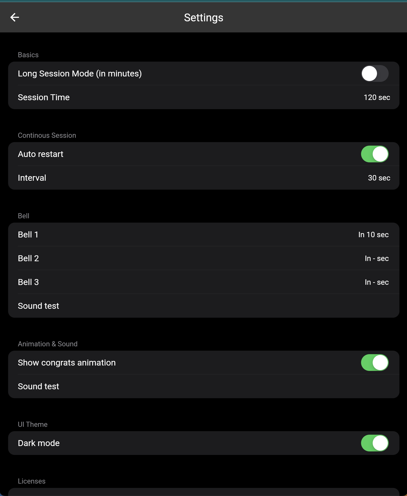

# lttimer

Timer for lightning talk sessions

## Releases

### Web
https://lttimer.wakamenod.com

### MacOS
Download app from [releases](https://github.com/wakamenod/lttimer/releases)

## 設定

- `基本`
    - セッション時間を設定できます。
    - 通常モード（デフォルト）の場合1分〜10分。長尺モードの場合11分〜60分より選択できます。
- `連続セッション`
    - 自動再スタートがONの場合（デフォルト)、セッション終了後にインターバルを挟み、自動で次のセッションがスタートします。また、インターバルの時間を設定できます。
- `ベル`
    - セッション中に時間経過のお知らせするベルの時間を3つまで設定できます。
 
## Settings

- `Basics`
    - You can set the session time.
    - In normal mode (default), you can select between 1 minute and 10 minutes. In Long Session mode, you can select between 11 minutes and 60 minutes.
- `Continuous Session`
    - If auto-restart is ON (default), after the session ends, there is an interval, then the next session starts automatically. Also, you can set the time for the interval.
- `Bell`
    - During the session, you can set up to three times to ring a bell to notify the passage of time.
